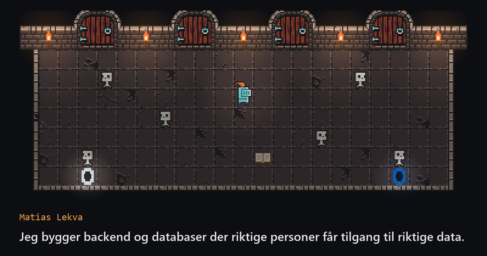

# matiaslekva-portfolio

Personlig portefølje for Matias Lekva, med en liten pikseldungeon som valgfri meny.

**Se siden:** https://felovax.github.io/matiaslekva-portfolio/



Porteføljen kommer først. Alt innhold er vanlig HTML og kan leses uten å røre spillet.
Dungeonen er en snarvei for den som vil: gå til en dør, trykk E, og siden ruller til
riktig seksjon.

## Dungeonen

- **WASD** eller piltastene går, **E** samhandler, **mellomrom** slår
- Fire dører fører til Om meg, Prosjekter, Erfaring og Kontakt
- Portaler til GitHub og LinkedIn, og en questlogg
- Seks skjeletter med navn som *Legacy Code* og *SQL Injection*, og noen påskeegg
- Skjules på små skjermer, og tar bare over tastaturet når den er synlig

## Teknologi og valg

- **Astro og TypeScript (strict).** Siden bygges til statisk HTML, og JavaScript lastes
  bare for dungeonen.
- **Egen spillmotor i Canvas, uten spillbibliotek.** Spillet er lite nok til at et
  bibliotek som Phaser (rundt 1 MB) ville vært mer enn nødvendig.
- **Innhold i typede datafiler** (`src/data/`), felles for siden og spillet.
- **Ingen server, database eller innlogging.** Bare statiske filer, og dermed lite å angripe.
- **Tilgjengelighet:** «Hopp til innholdet», synlig fokus, kontrast over WCAG AA,
  beskrivelse for skjermlesere, og respekt for «reduser bevegelse».
- **Publisering:** GitHub Actions typesjekker og publiserer til GitHub Pages ved hver
  push til `main`. Hver jobb har bare tilgangene den trenger.

## Spillmotoren (`src/game/`)

| Fil | Ansvar |
| --- | --- |
| `main.ts` | Spill-løkken: oppdater, tegn, gjenta, rundt 60 ganger i sekundet |
| `kart.ts` | Kartet som tekst, tegning av rommet og kollisjon mot vegger |
| `figur.ts` | Felles bevegelse og kollisjon (AABB) for spiller og skjeletter |
| `spiller.ts` | Ridderen: bevegelse, retning og animasjon |
| `skjeletter.ts` | Skjelettene: vandring, treff og fall |
| `kamp.ts` | Sverdslag, treffområde og XP |
| `objekter.ts` | Dører, questlogg, portaler og gummianda |
| `input.ts` | Tastaturet: hvilke taster som holdes nede, og hvilke som nettopp ble trykket |
| `lys.ts` | Mørke og flimrende fakkellys med et offscreen canvas |
| `ui.ts` | All HTML oppå spillet: skilt, hint, meldinger og questlogg |
| `sprites.ts` | Spritesheet, utsnitt og animasjoner |
| `paaskeegg.ts` | Påskeegg som handler om hva spilleren gjør |
| `mindreBevegelse.ts` | Sjekker om brukeren har bedt om mindre bevegelse |

## Kjøre lokalt

```bash
npm install
npm run dev      # utviklingsserver på http://localhost:4321/matiaslekva-portfolio/
npm run check    # typesjekk
npm run build    # bygger den ferdige siden til dist/
npm run preview  # viser den bygde siden lokalt
```

## Struktur

```
src/
  pages/              index.astro (forsiden) og 404.astro
  layouts/            felles <html>-ramme med tagger for deling
  components/         Header, Seksjon, ProsjektKort, Dungeon, Footer
  data/               alt innholdet; endre tekst her
  game/               spillmotoren (se over)
  styles/global.css   farger og grunnstil
public/               favicon, delingsbilde og grafikk
docs/plan.md          plan og beslutninger
```

## Grafikk

Pikselgrafikken i dungeonen er [16x16 DungeonTileset II](https://0x72.itch.io/dungeontileset-ii)
av 0x72, med CC0-lisens. Fakler, questlogg, portaler og gummiand er tegnet i kode.
